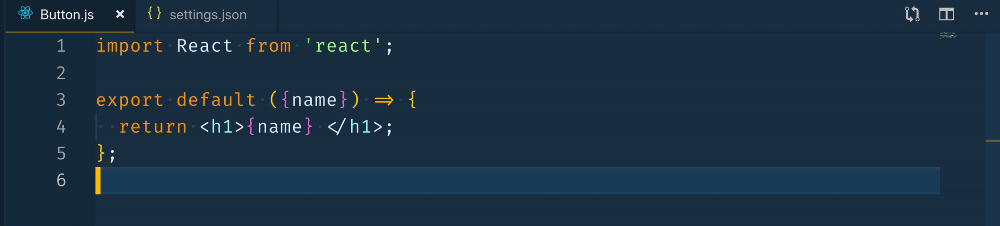

export { future as theme } from "mdx-deck/themes";

import { Notes } from "mdx-deck";
import { Invert, FullScreenCode } from "mdx-deck/layouts";
import { Split } from "mdx-deck/layouts";
import { Appear } from "mdx-deck";
import { Img } from "./components/Img.js";
const vscode = `
{
  "editor.formatOnSave": true,
  "prettier.eslintIntegration": true,
  "[javascript]": {
    "editor.formatOnSave": false
  },
  "eslint.autoFixOnSave": true,
  "prettier.disableLanguages": ["js"]
}
`;

## 🛠🛠

<h1> Improving React Code Quality with the Right Tools </h1>

## 🛠🛠

<Notes> Hi every one </Notes>

---


## WHO AM I ?

<ul style={{ textAlign: "left" }}>
  <Appear>
    <li>I am Youssouf El Azizi 😊</li>
    <li>
      Full stack engineer at{" "}
      <a style={{ color: "#fff" }} target="_blank" href="https://obytes.com">
        {" "}
        Obytes{" "}
      </a>{" "}
      🍊{" "}
    </li>
    <li>
      OSS believer , working on a react component (500k download) ,{" "}
      <a
        style={{ color: "#fff" }}
        target="_blank"
        href="https://react-popup.elazizi.com"
      >
        {" "}
        🔗{" "}
      </a>{" "}
    </li>
    <li>
      I publish stories at my personal website{" "}
      <a style={{ color: "#fff" }} target="_blank" href="https://elazizi.com">
        {" "}
        https://elazizi.com{" "}
      </a>{" "}
    </li>
  </Appear>
</ul>

---

### Hwo is working with React 👋 ?

<ul style={{ listStyleType: "none" }}>
  <Appear>
    <li>
      <h1> Improving 🔥Javascript🔥 Code Quality with the Right Tools</h1>{" "}
    </li>
  </Appear>
</ul>

---

## This talk is about :

<ul style={{textAlign:'left'}}>
  <Appear>
    <li>Improve developer experience 👨🏻‍💻 </li>
    <li>Smart and free Tools  </li>
    <li>Easy to get started with => one Day for setup </li>
    <li>CheckList : a step by step </li>

  </Appear>
</ul>

---

## This talk is not about :

<ul style={{ textAlign: "left" }}>
  <Appear>
    <li>Testing : jest ... </li>
    <li>Typing : flow , typescript </li>
  </Appear>
</ul>

---

## Code Quality

High quality, familiar, consistent code is easier to read and understand.

---

### Four levels to ensure Code Quality

<ul style={{ listStyleType: "none" }}>
  <Appear>
    <li>
      <h3>IDE or Code Editor </h3>
    </li>
    <li>
      <h3>Git Tools </h3>
    </li>
    <li>
      <h3>CI Tools </h3>
    </li>
    <li>
      <h3>Monitoring Tools </h3>
    </li>
  </Appear>
</ul>

---

## VSCode

One of the best choice for javascript developer
A great extension ecosystem

---

### Babel JavaScript


---

### Fira Code (font)


---

### Spelling Checker


---

### GitLens


---

## ESLINT

What is linting? It is a statical (without executing) code check — coding standards complying, best-practices, potential errors, and many more.

---

## ESLINT

`npm install eslint --save-dev`

#### or

`npm install -g eslint`

### ↓

`eslint yourfile.js`

---

import { CodeSurfer } from "mdx-deck-code-surfer";
import eslintCode from "raw-loader!./files/eslint.js";

<CodeSurfer
  title="Eslint Config .eslint.js"
  code={eslintCode}
  lang="javascript"
  showNumbers={false}
  dark={true}
  steps={[
    { notes: "export a config object " },
    {
      range: [2, 4],
      notes: "extends your config from presets ( AirBnb , google ....)  "
    },
    {
      range: [5, 12],
      notes: "Parser Option : Esprima , babel-eslint , typescript   "
    },
    { range: [22, 33], notes: "Rules   " }
  ]}
/>

---

### Install ESLint VSCode Extension


"eslint.autoFixOnSave": true
---

## Prettier

<ul style={{ textAlign:'left' }}>
  <Appear>
    <li>
      Code formatting Tools
    </li>
    <li>
      Very opinionated and does all for you
    </li>
    <li>
      JavaScript · TypeScript · CSS · JSX · JSON
    </li>

  </Appear>
</ul>

---

## Prettier

`npm install prettier --save-dev`

#### or

`npm install -g prettier`

### ↓

`prettier yourfile.js`

---

import prettierCode from "raw-loader!./files/prettier.js";

<CodeSurfer
  title="prettier Config .prettierrc.js"
  code={prettierCode}
  lang="javascript"
  showNumbers={false}
  dark={true}
/>

---

### Install Prettier VSCode Extension


<br />
"editor.formatOnSave": true
---

## 💥 Opps 💥

VsCode && Eslint && Prettier try to fix you code in the same time



---

## Prettier ❤️ ESLINT ❤️ VSCODE

---

import preEsCode from "raw-loader!./files/eslint-prettier.js";

<CodeSurfer
  title=".eslitrc.js"
  code={preEsCode}
  lang="javascript"
  showNumbers={false}
  dark={true}
  steps={[
    {
      range: [2, 4],
      notes:
        "extends your config from  prettier presets and use prettier config plugin   "
    },
    { range: [22, 27], notes: "add prettier Rules  " }
  ]}
/>

---

<CodeSurfer
  title="vscode settings "
  code={vscode}
  lang="javascript"
  showNumbers={false}
  dark={true}
  steps={[
    {
      lines: [3],
      notes: "auto-save config for prettier"
    },
    {
      lines: [4],
      notes: "prettier and eslint integration "
    },
    {
      range: [5, 7],
      notes: "Disable format  autosave for js files  "
    },
    {
      lines: [8],
      notes: "enable autFixOnSave  "
    },
    {
      lines: [9],
      notes: "disable  prettier autoformat  for js files  "
    }
  ]}
/>

---

## GiT Hooks

---

## So, what we need to check in a commit?

<ul style={{ textAlign:'left' }}>
  <Appear>
    <li>
      GIT naming conventions
    </li>
    <li>
      Linting
    </li>
    <li>
      Tests
    </li>

  </Appear>
</ul>

---

## Husky

🐕 Husky makes it easier for us to write Git Hooks - commands that run when we call specific Git actions.

`Husky basically transforms GIT hooks into npm scripts)`

---

`npm install husky --save-dev`

```js
// package.json
{
  "husky": {
    "hooks": {
      "pre-commit": "npm test",
      "pre-push": "npm test",
      "...": "..."
    }
  }
}

```

---

## code review , Why is important ?

---

## use Netlify for preview

---
